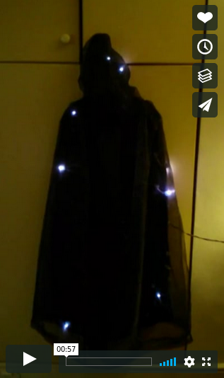

The Colour Stealing Cloak
=========================

An interactive, wearable art project. Steal colours by touching them and transfer them to the cloak.

Components
----------

* A black cloak with 150 WS2801 (addressible RGB) LEDs sewn evenly under an organza cover
* A glove, with a colour sensor on the index finger and two buttons on the middle finger
* A large battery on a shoulder strap
* An Arduino Nano

Script
------

_Alice, wearing the cloak (which is twinkling white)_

_Bob, wearing a blue hat_

Alice, looking at Bob's hat: “Oh, I like your hat! It’s a lovely shade of blue!”

Bob: "Oh, thank you!"

Alice, looking Bob straight in the eye: “Such a lovely colour! _I’m going to steal your colour!!!_”

Bob: "???!!"

_Alice touches Bob's hat and presses the 'sense' button with her thumb. The cloak changes colour to match Bob's hat_

_Bob's mind is blown_

Photos
------

